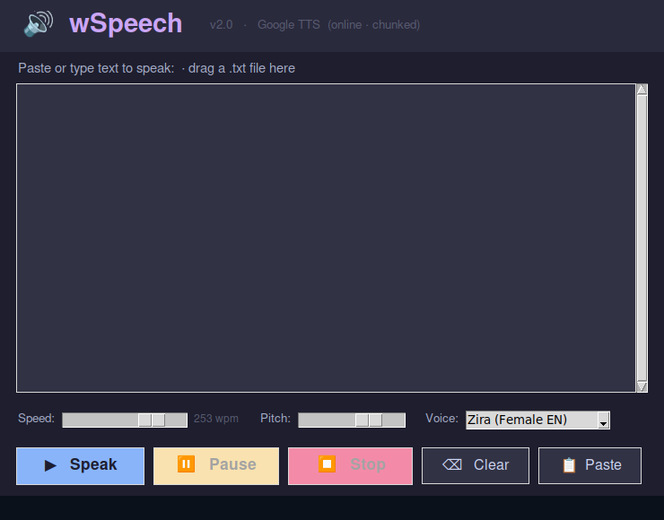

# 🔊 wSpeech v2.0

> **Text-to-Speech for Linux / NVIDIA DGX**  
> Paste any text, hit Speak — hear it read back instantly.  
> A native Linux reimplementation of the Windows wSpeech app, built in Python.

---



---

## ✨ Features

- **Fast startup** — text is split into sentence chunks and pre-fetched in parallel; first audio plays in ~1–2 seconds
- **Real-time speed control** — change the speed slider mid-reading and the next sentence picks it up immediately
- **Pause / Resume** — freeze and continue exactly where you left off
- **Instant Stop** — kills audio immediately, no waiting for a download to finish
- **Drag & drop** — drag any `.txt`, `.md`, `.log`, or other plain-text file onto the window to load it
- **Settings remembered** — speed, pitch, and voice are saved to `~/.config/wspeech/settings.json` and restored on next launch
- **Desktop icon** — auto-created on every launch (`~/Desktop/wSpeech.desktop`)
- **Dark theme** — Catppuccin Mocha palette

---

## 🎙️ Voice / TTS Backend

The app automatically picks the best available backend:

| Priority | Backend | Quality | Requires |
|----------|---------|---------|----------|
| 1 | **Google TTS** (`gTTS`) | ★★★★☆ Zira-like female EN | Internet + `pip install gTTS pygame` |
| 2 | **pyttsx3 + espeak-ng** | ★★★☆☆ Offline | `pip install pyttsx3` + `apt install espeak-ng` |
| 3 | **espeak-ng CLI** | ★★☆☆☆ Offline fallback | `apt install espeak-ng` |

Speed adjustment is applied via `ffmpeg`'s `atempo` filter after download, giving full control from 0.5× to ~2×.

---

## 🚀 Installation

```bash
# Clone
git clone https://github.com/MeeshMakes/wspeech.git
cd wspeech

# System deps
sudo apt install -y espeak-ng ffmpeg

# Python deps
pip3 install gTTS pygame pyttsx3 tkinterdnd2 Pillow --break-system-packages

# Generate the icon
python3 make_icon.py

# Run
python3 wspeech.py
```

A `wSpeech.desktop` icon will appear on your desktop automatically on first launch.

---

## 🖥️ Requirements

- Linux (tested on Ubuntu 24.04 / NVIDIA DGX)
- Python 3.10+
- `tkinter` (usually included with Python)
- `ffmpeg` (for speed control)
- Internet connection for Google TTS (falls back to espeak-ng offline)

---

## 📁 File Structure

```
wspeech/
├── wspeech.py          # Main application
├── make_icon.py        # Generates wspeech_icon.png
├── launch.sh           # Shell launcher (regenerates icon then runs app)
├── wspeech_icon.png    # App icon (auto-generated)
└── screenshots/
    └── preview-clean.png     # UI screenshot
```

---

## 🔧 Controls

| Button | Action |
|--------|--------|
| ▶ Speak | Start reading the text |
| ⏸ Pause | Pause mid-sentence |
| ▶ Resume | Continue from where paused |
| ⏹ Stop | Stop immediately |
| ⌫ Clear | Clear the text area |
| 📋 Paste | Paste from clipboard |

**Drag & drop** a text file onto the text area to load it (replaces current content).  
**Ctrl+A** selects all text in the editor.

---

## 📝 License

MIT — do whatever you want with it.
